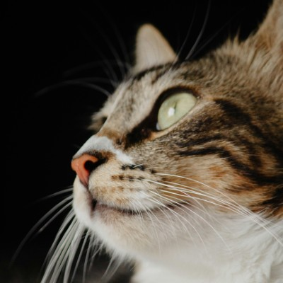
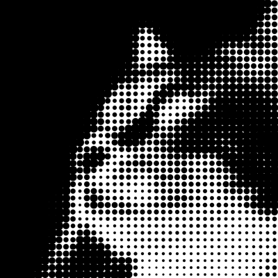
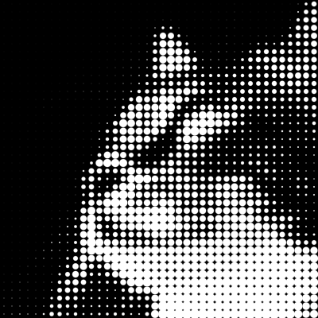

# Halftone (gradients, shapes and images)

[:arrow_left: Back to documentation](index.md)

- [What it is](#what-it-is)
- [Loading the renderer](#loading-the-renderer)
- [Gradient fill](#gradient-fill)
- [Filling a shape](#filling-a-shape)
- [Halftoning an image](#halftoning-an-image)
- [Live shader vs. bake-and-blit](#live-shader-vs-bake-and-blit)
- [Placement: HalftoneBake.origin](#placement-halftonebakeorigin)
- [Key parameters](#key-parameters)
- [Filling a stroke-defined shape](#filling-a-stroke-defined-shape)
- [Performance notes](#performance-notes)


## What it is

[`HalftoneRenderer`](../lib/src/display/halftone.dart#:~:text=class+HalftoneRenderer)
draws **halftone dots** — the lattice of variably-sized circles a print screen
makes — with a fragment shader. It does three things:

- **[Gradient fill](#gradient-fill)** — a lattice of dots whose size follows a gradient (arbitrary
  axis, rotation, stops, and a phase offset for aligning dots across a seam).
- **[Shape fill](#filling-a-shape)** — fill any `dart:ui` `Path`, either *clipped* (dots sliced at
  the boundary) or by *whole dots* (a dot is kept if its centre is inside, and
  drawn whole so circles spill past the edge, with a feathered silhouette).
- **[Image halftone](#halftoning-an-image)** — reproduce any `ui.Image` as dots, driven by luminance through a tone curve.

## Loading the renderer

The shader programs are loaded once. Keep the returned renderer and reuse it:

```dart
import 'package:sizzle/sizzle.dart';

final halftone = await HalftoneRenderer.load();
```

`load()` reads the three shaders that ship inside Sizzle
(`packages/sizzle/shaders/halftone*.frag`); do it at startup, not per frame.


## Gradient fill

Describe the fill with a
[`HalftoneGradient`](../lib/src/display/halftone.dart#:~:text=class+HalftoneGradient):
an axis, a `gridSize`, and a list of
[`HalftoneStop`](../lib/src/display/halftone.dart#:~:text=class+HalftoneStop)s
mapping position along the axis (0..1) to dot `amount` (0 = background, 1 = solid
foreground):

```dart
final gradient = HalftoneGradient.vertical(
  size: const Size(200, 320),
  gridSize: 8,
  stops: const [
    HalftoneStop(0.0, 0.0), // top: no dots
    HalftoneStop(1.0, 1.0), // bottom: solid
  ],
);
```

Build the amount LUT once, then apply the shader as a `Paint.shader` wherever you
render:

```dart
final lut = await halftone.buildLut(gradient);

// inside a component's render(canvas):
canvas.drawRect(
  const Offset(0, 0) & const Size(200, 320),
  Paint()..shader = halftone.shaderFor(gradient, lut),
);
```

`HalftoneGradient.vertical` and `HalftoneGradient.horizontal` are conveniences
for the common top-to-bottom / left-to-right axes; the unnamed constructor takes
arbitrary `axisStart` / `axisEnd` endpoints for any angle.

Only the `stops` and `growth` mode affect the LUT — the axis, angle, offset,
grid and colours are cheap shader uniforms, so you can vary them per frame while
reusing the same `lut`.


## Filling a shape

`bake` fills a `Path`. Its `clip` flag chooses how the boundary is treated.

**Clip (per-pixel, the default).** The halftone fills the path and everything
outside is transparent; dots are sliced at the boundary:

```dart
final bake = await halftone.bake(gradient, myPath); // clip: true
canvas.drawImage(bake.image, bake.origin, Paint());
```

**Preserve dots (per-dot).** With `clip: false`, a dot is kept whenever its
*centre* is inside the path and drawn whole, so circles spill past the edge. The
background stays bounded by the path, and `feather` antialiases the silhouette
(edge dots shrink smoothly instead of popping off):

```dart
final bake = await halftone.bake(gradient, myPath, clip: false); // feather = grid*0.6
canvas.drawImage(bake.image, bake.origin, Paint());
```

Pass `feather: 0` for a crisp cutoff (`feather` is ignored when `clip: true`).
Whole-dot output is premultiplied alpha, so it composites correctly over
whatever is behind it.


## Halftoning an image

`halftoneImage` reproduces a `ui.Image` as dots. Each dot takes the tone of the
average source luminance (Rec. 709) of the cell, or a sample at the cell centre if
`averageCells` is `false`. This sample is mapped through `tone`:

```dart
final dots = await halftone.halftoneImage(
  sourceImage,
  gridSize: 6,
  // tone defaults to HalftoneRenderer.defaultTone (dark -> full dot)
);
canvas.drawImage(dots, Offset.zero, Paint());
```

`tone` doubles as a levels/contrast curve. `averageCells` (default `true`)
pre-blurs the source by half a cell so each centre sample reads as a cell
average — this is what keeps silhouettes smooth; set it `false` to point-sample.
For photographs, `growth: HalftoneGrowth.linear` retains highlights, while
`area` over-darkens the mid-tones.

Example (photo by [Ghessyka Schmidt](https://unsplash.com/@kahschmidt) on [Unsplash](https://unsplash.com/photos/a-close-up-of-a-cat-with-a-black-background-HQ8syHeA4Fw)):

 

### Inverting the tone

To render the same halftone image as white dots on a black background, swap
the colors and also invert the tone curve:

```dart
final dots = await halftone.halftoneImage(
  sourceImage,
  gridSize: 6,
  foreground: const Color(0xFFFFFFFF),
  background: const Color(0xFF000000),
  tone: const [
    HalftoneStop(0.0, 0.0), // dark source  -> no dot
    HalftoneStop(1.0, 1.0), // light source -> full dot
  ],
);
```

 

## Live shader vs. bake-and-blit

There are two rendering models. Both produce the same output but are used in different situations:

- **Live** — call `buildLut` (and, for whole-dot shapes, `rasterizePathMask`)
  once, then set `shaderFor` / `shaderForPathDots` as a `Paint.shader` every
  frame. Use this when the fill's parameters change frame-to-frame.
- **Bake** — `bake` runs the shader once into a cached `ui.Image`. Blit that
  image while it scrolls. This is the production path for static content and the
  one to reach for on watch hardware.


## Placement: HalftoneBake.origin

`bake` returns a
[`HalftoneBake`](../lib/src/display/halftone.dart#:~:text=class+HalftoneBake) —
the `image` plus an `origin`, the coordinate of the image's top-left pixel in the
path's own space:

```dart
// draw the shape exactly where its path is defined:
canvas.drawImage(bake.image, bake.origin, paint);

// put the path's own (0,0) at some target t:
canvas.drawImage(bake.image, t + bake.origin, paint);
```

`bake` always auto-fits its output to the path — tightly to the path bounds when
`clip: true`, or inflated by
[`HalftoneRenderer.pathDotsSpill`](../lib/src/display/halftone.dart#:~:text=pathDotsSpill)
when `clip: false` so spilled dots aren't clipped (then `origin` sits above-left
of the path bounds by that margin). Auto-fitting re-anchors the dot lattice to
the crop origin, so to line dots up across two separately-baked slices at a
shared seam, use the gradient's 2D `offset` (see below).


## Key parameters

- **`gridSize`** — lattice spacing in pixels (dot pitch).
- **`rotation`** — lattice rotation in radians.
- **`growth`** — [`HalftoneGrowth.linear`](../lib/src/display/halftone.dart#:~:text=enum+HalftoneGrowth)
  (radius ∝ amount) or `area` (radius ∝ √amount, a perceptually even ramp).
- **`stops`** / **`tone`** — the amount-vs-position (or luminance) curve.
- **`offset`** — a 2D (`Offset`) phase shift in pixels that moves the dot
  lattice in x and y. `Offset.zero` leaves it at the default crop-anchored
  position; since a bake re-anchors the lattice to its crop origin, use this to align adjacent halftones.
- **`feather`** (whole-dot fills, i.e. `clip: false`) — mask blur sigma; softens
  the silhouette. Defaults to `gridSize * 0.6`; `0` is a crisp cutoff. Ignored
  when `clip: true`.
- **`averageCells`** (image) — pre-blur the source for smooth silhouettes.


## Filling a stroke-defined shape

If using [`StrokePath`](variable_width_stroke.md) (used for variable-width strokes),
turn it into a fillable `Path` with `toPath()` and hand that to `bake`:

```dart
final spec = StrokePath(const Offset(40, 40), close: true)
  ..lineTo(const Offset(160, 60))
  ..curveTo(const Offset(180, 160), const Offset(60, 180));

final bake = await halftone.bake(gradient, spec.toPath(), clip: false);
canvas.drawImage(bake.image, bake.origin, Paint());
```

(For a sensible fill the `StrokePath` should be closed.)


## Performance notes

The shaders avoid derivative functions (`fwidth`/`dFdx`), so they build on both
Skia and Impeller and can even run on smartwatch-class GPUs. Anti-aliasing uses
a fixed 0.75px edge, valid because content is baked at 1:1 resolution.

For content where the gradient itself does not change (for example, a scrolling
tile), **bake once and blit** rather than running the shader every frame — a
slice's gradient is static once spawned, so `bake` it to a `ui.Image` on spawn
and translate that image per frame. Reuse the amount LUT (and the renderer)
across bakes; only rebuild the LUT when the stops or growth mode change.
